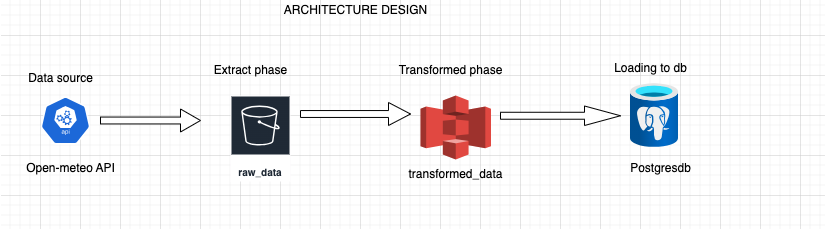
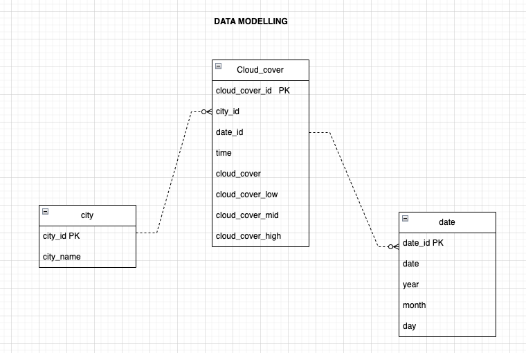

# data_interview_speedcast
Data Engineering tasks for Speedcast

This project fetches hourly cloud cover data for London, Amsterdam, and Lisbon from the Open-Meteo API, stores it in a PostgreSQL database, and analyzes the data using SQL.

## Setup

1. Install Python, PostgreSQL, and DBeaver.
2. Clone this repository.
3. Install required Python packages: `pip install -r requirements.txt`
4. Set up your PostgreSQL database and update the connection details in the script.

## Project Structure

- `etl.py`: Script to fetch data from the Open-Meteo API.
- `util.py`: Script to store the fetched data in PostgreSQL.
- `query.sql`: SQL query for data analysis.
- `requirements.txt`: List of required Python packages.
- `Dockerfile`: To containerize the application with the `main.py`

## Technical architecture

## Dimensional data modelling

Star schema depicted below

## Running the Project

1. Run `python etl.py` to fetch the data.
2. Run `python util.py` to store the data in PostgreSQL.
3. Use DBeaver to connect to your PostgreSQL database and run the SQL query in `query.sql`.

## Analysis

The SQL query calculates the average cloud cover for each city, month, and year in 2020. The results can be visualized using DBeaver's charting capabilities.
